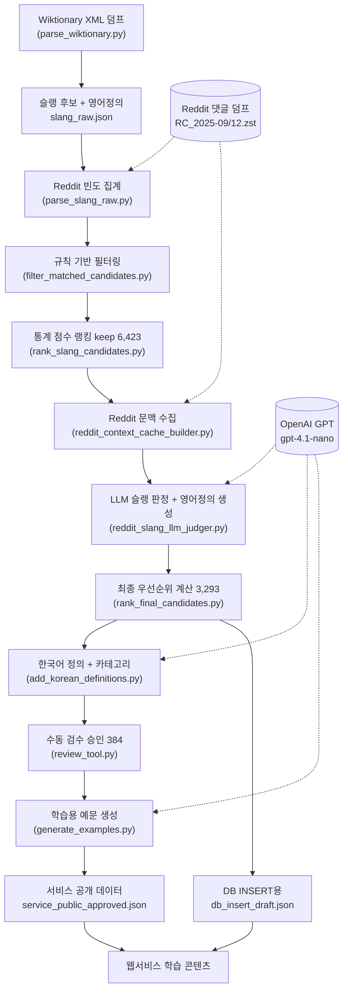

# 영어 슬랭 학습 데이터 구축·전처리 프로젝트 — 최종보고서용 분석

> **프로젝트**: English-INSSA-DATA-PROJECT
> **분석 목적**: 졸업작품 최종보고서에 들어갈 데이터 구축·전처리·검증 과정 및 최종 데이터 구조 정리
> **분석 근거**: `data_pipeline/` 내 Python 스크립트 10개, `PIPELINE_REPORT.md`, `data_pipeline/CLAUDE.md`, `data_pipeline/output/`의 실제 산출 데이터(레코드 수·필드 직접 확인)
> **주의**: 코드는 수정·실행하지 않고 분석만 수행함. 모든 수치는 실제 출력 파일에서 직접 카운트하여 확인함. 확실하지 않은 내용은 `[확인 필요]`로 표시함.

---

## 1. 데이터 프로젝트 요약

### 보고서용 설명문

본 프로젝트는 한국인 영어 학습자를 위한 **영어 슬랭(slang)·비격식 표현 학습 데이터셋**을 구축하기 위한 데이터 수집·전처리·검증 파이프라인이다. 사전 데이터(Wiktionary)에서 슬랭 후보 단어를 규칙 기반으로 추출한 뒤, 실제 온라인 대화 데이터(Reddit 댓글 덤프)에서 사용 빈도를 집계하여 "사전에는 있으나 실제로는 거의 쓰이지 않는" 표현을 통계적으로 걸러낸다. 이후 살아남은 후보에 대해 Reddit 실제 문맥을 LLM(GPT)으로 판정하여 해당 단어가 실제 슬랭 의미로 쓰이는지 확인하고, 영어 정의·한국어 정의·서비스 카테고리·학습용 예문을 단계적으로 보완한다. 최종적으로 사람이 수동 검수하여 서비스에 공개할 단어를 확정한다. 산출물은 단어·정의·예문·카테고리를 포함한 구조화된 JSON/JSONL 데이터로, 학습용 웹서비스의 DB에 투입(INSERT)되도록 설계되어 있다.

### 핵심 요약

- 목적: 사전 기반 후보를 **실제 사용 데이터로 검증**하여 신뢰도 높은 영어 슬랭 학습 데이터셋 구축
- 데이터 소스: Wiktionary(사전), Reddit 댓글 덤프(실사용 검증), OpenAI GPT(의미·예문 보완)
- 처리 규모: Wiktionary 후보 → Stage 4 keep 6,423개 → 최종 데이터 3,293개 → 수동 검수 승인 384개
- 최종 산출물: `output/final_dataset.jsonl`(3,293), `output/db_insert_draft.json`(3,293, DB 투입용), `output/service_public_approved.json`(384, 서비스 공개 확정)
- 웹서비스 활용: 단어·영어/한국어 정의·예문·카테고리를 슬랭 학습 콘텐츠로 제공 (DB INSERT용 파일 존재)

---

## 2. 데이터 출처 분석

| 출처 | 사용 목적 | 수집/활용 데이터 | 관련 코드 파일 | 비고 |
|---|---|---|---|---|
| **Wiktionary** (enwiktionary XML 덤프) | 슬랭 후보 단어 + 영어 정의 1차 추출 | 영어 표제어, 정의문, 예문, 원본 라벨(slang/informal 등) | `parse_wiktionary.py` | 입력: `dump/enwiktionary-20250920-pages-articles-multistream.xml.bz2` (bz2 스트리밍 파싱) |
| **Reddit 댓글 덤프** (`.zst` 파일) | 후보 단어의 **실제 사용 빈도·문맥** 수집 (검증용) | 댓글 본문(body), 등장 빈도(match_count), subreddit | `parse_slang_raw.py`(빈도 집계), `reddit_context_cache_builder.py`(문맥 수집) | 로컬 파일 사용: `RC_2025-09.zst`, `RC_2025-12.zst`. **Reddit API/PRAW가 아닌 오프라인 덤프 파일** 직접 스트리밍 |
| **OpenAI GPT API** (`gpt-4.1-nano`) | 슬랭 여부 판정, 영어/한국어 정의·카테고리·예문 생성 | 입력: Reddit 문맥·영어 정의 / 출력: 판정 결과·정의·카테고리·예문 | `reddit_slang_llm_judger.py`, `add_korean_definitions.py`, `generate_examples.py` | 모델 기본값 `gpt-4.1-nano`, 환경변수 `OPENAI_MODEL`로 변경 가능, `temperature=0` |
| **자체 작성 리소스(JSON)** | 필터링·점수 보정 규칙 | 도메인 어휘, 극성 어휘, 단서 매핑, 연결 금지 규칙 | `resources/domain_lexicon.json`, `polarity_lexicon.json`, `canonical_cue_map.json`, `cannot_link_rules.json` | 사람이 정의한 규칙 사전 |
| **수동 검수(사람)** | 서비스 공개 단어 최종 승인/보류 | 승인/보류/수정필요 분류 | `review_tool.py` | AI 미사용, CLI 기반 사람 판단 |

> `[확인 필요]` Reddit 덤프 파일(`RC_2025-09`, `RC_2025-12`)이 2025년 9월·12월 댓글이라는 점은 파일명 기준 추정이며, 실제 수집 기간·범위는 사용자 확인 필요.

---

## 3. 데이터 수집 과정

### 보고서용 설명문

데이터 수집은 두 갈래로 진행된다. 첫째, Wiktionary XML 덤프를 스트리밍 파싱하여 영어 섹션의 정의 라벨에서 슬랭/비격식 후보를 추출한다(Stage 1). 둘째, 추출된 후보를 Reddit 댓글 덤프와 대조하여 실제 등장 횟수를 집계하고(Stage 2), 이후 통계 점수 기준으로 선별된 후보에 대해 Reddit 실제 문맥(예문)을 후보별로 수집한다(Stage 5). 즉 "사전 후보 수집 → 실사용 빈도 집계 → 실사용 문맥 수집" 순서다.

### 단계별 흐름표

| 단계 | 수집 대상 | 수집 방식 | 결과 파일(코드 기준) | 주요 스크립트 |
|---|---|---|---|---|
| Stage 1 | Wiktionary 슬랭 후보 + 영어 정의 | `ElementTree.iterparse`로 bz2 XML 스트리밍, `==English==` 섹션의 slang/informal/aave/colloquial 라벨 감지 | `output/slang_raw.json` | `parse_wiktionary.py` |
| Stage 2 | 후보 단어의 Reddit 등장 횟수 | 후보를 n-gram 인덱스화 → Reddit `.zst` 스트리밍 → 댓글 토큰 매칭, match_count·subreddit 누적 | `matched_candidates.json`, `unmatched_candidates.json`, `candidate_usage_stats.json` | `parse_slang_raw.py` |
| Stage 5 | 후보별 Reddit 실제 문맥(예문) | `.zst` 2개를 멀티프로세스 병렬 스캔, Reservoir Sampling(seed=42), context_id 해시 중복 제거 | `candidate_context_cache.jsonl`, `candidate_context_summary.jsonl` | `reddit_context_cache_builder.py` |

> `[확인 필요]` Stage 1·2·5의 중간 산출 파일(`slang_raw.json`, `matched_candidates.json`, `candidate_context_cache.jsonl` 등)은 git에 포함되어 있지 않아(대용량) 실제 파일 내용은 확인하지 못함. 경로·동작은 코드 및 `PIPELINE_REPORT.md` 기준.

---

## 4. 데이터 전처리 과정

| 전처리 항목 | 처리 목적 | 실제 처리 방식(코드 기준) | 관련 코드 파일 | 보고서용 설명 |
|---|---|---|---|---|
| **불필요 후보 제거(필터링)** | 비슬랭·저빈도 후보 제거 | Reddit 매칭 이력 없음 / stopword 단독 / 기능어 구문 블랙리스트 / 기본 `match_count < 200` 제거 | `filter_matched_candidates.py` | 사전상 후보 중 실제로 거의 안 쓰이는 표현을 1차 제거 |
| **통계 기반 선별(랭킹)** | 사용량 신뢰도 점수화 | `support_score = 0.6·log10(1+match_count) + 0.4·log10(1+subreddit_count)`, keep(≥3.65)/gray_zone/prune 분류 | `rank_slang_candidates.py` | keep 후보 6,423개만 다음 단계로 통과 |
| **중복 문맥 제거** | 동일 문맥 중복 수집 방지 | `context_id` 해시 기준 중복 제거, Reservoir Sampling으로 단어별 문맥 수 상한 | `reddit_context_cache_builder.py` | 단어별 문맥 표본의 다양성·균형 확보 |
| **문맥 부족 데이터 제거** | 판정 근거 부족 단어 제거 | 캐시 문맥 < 60개이면 `drop`, 초기 60개 판정 결과 슬랭 0건이면 `drop` | `reddit_slang_llm_judger.py` | 근거가 부족한 단어를 데이터에서 배제 |
| **필터링(최종 후보 선정)** | 약한 근거 후보 정리 | `decision==drop` 제외, holdout은 `slang_hits≥3` AND `slang_ratio≥1.67%`만 포함 | `rank_final_candidates.py` | 6,423 → 3,293개로 최종 압축 |
| **필드명/형식 통일** | 단어 정규화 | `normalized_word` 키 사용, single_token/dispersion_score 등 정규화 필드 부여 | `rank_final_candidates.py`, `reddit_slang_llm_judger.py` | 단어 표기·필드 일관화 |
| **카테고리 분류** | 서비스용 분류 부여 | LLM이 14개 고정 카테고리 중 1~3개 선택 (JSON 배열) | `add_korean_definitions.py` | 학습 서비스 UI 분류용 |
| **유해/노골 표현 표시** | 노출 제어용 플래그 | `EXPLICIT_WORDS` 집합과 대조하여 `is_vulgar` 부여 | `rank_final_candidates.py` (L49~) | 욕설·성적 표현 필터링 근거 |
| **저장 형식 변환** | DB 투입용 변환 | `final_dataset.jsonl` → 서비스 필드(`emoji`, `shorts_url` 등) 포함 JSON 배열로 변환 | `db_insert_draft.json`(산출물) | DB INSERT용 형식 |

> `[확인 필요]` `db_insert_draft.json` 생성 스크립트는 현재 git 추적 파일에서 확인되지 않음(산출물만 존재). 변환 로직의 정확한 코드 위치는 사용자 확인 필요.

---

## 5. Reddit 기반 검증 과정

Reddit 데이터 사용은 코드에서 **명확히 확인됨** (`parse_slang_raw.py`, `reddit_context_cache_builder.py`, `reddit_slang_llm_judger.py`).

- **사용 목적**: 사전(Wiktionary)에서 뽑은 슬랭 후보가 **실제 온라인 대화에서 슬랭 의미로 쓰이는지** 검증.
- **가져오는 데이터**: Reddit 댓글 본문(`body`). 로컬 `.zst` 덤프(`RC_2025-09.zst`, `RC_2025-12.zst`)를 `zstandard`로 스트리밍 (Reddit API 아님).
- **빈도 활용**: `parse_slang_raw.py`가 단어별 등장 횟수(`match_count`)와 등장 subreddit을 집계 → `rank_slang_candidates.py`의 support_score에 반영.
- **맥락/문맥 활용**: `reddit_context_cache_builder.py`가 단어가 포함된 실제 댓글 문맥을 단어별 수십~수백 개 수집(빈도 tier별 100~200개).
- **실사용 판단 방식**: `reddit_slang_llm_judger.py`가 수집된 문맥을 LLM에 전달, 문맥별로 `is_slang` 판정 → 슬랭 판정 수 K가 15 이상이면 `enough_evidence`, K=0이면 `drop`, 그 사이면 추가 배치 판정 후 `holdout`.
- **빈도+맥락 결합**: 최종 우선순위(`rank_final_candidates.py`)는 `slang_ratio = slang_hits/sampled`와 `match_count`를 곱한 기대 사용량으로 점수화.

**요약**: 빈도(통계)로 1차 거르고, 실제 댓글 문맥을 LLM이 슬랭 여부로 판정하여 검증하는 2단계 구조. 빈도·맥락 모두 사용하며, 게시글/댓글 중 **댓글(comments) 덤프**를 사용함이 코드에서 확인됨.

> `[확인 필요]` 슬랭 판정 임계값(K_TARGET=15, slang_ratio≥1.67%) 등 기준치의 설정 근거(실험/경험적 결정 여부)는 코드에 설명이 없어 사용자 확인 필요.

---

## 6. GPT / AI 활용 과정

AI 사용은 코드에서 **명확히 확인됨**. 모델 기본값 `gpt-4.1-nano`(환경변수 `OPENAI_MODEL`로 변경 가능), `temperature=0`, JSON 응답 강제.
**API Key 등 민감정보는 출력하지 않음** (코드상 환경변수 `OPENAI_API_KEY`로만 참조).

| 활용 위치 | 목적 | 입력 | 출력 | 프롬프트 핵심 역할 |
|---|---|---|---|---|
| `reddit_slang_llm_judger.py` (Stage 6) | ① 문맥별 슬랭 여부 판정 ② 영어 정의·슬랭 유형 생성 | 단어 + Reddit 문맥 묶음 | `is_slang` 판정 배열 / `definition_en`, `slang_category` | "슬랭 사용 분류기" + "슬랭 사전 편집자" 역할 부여, 슬랭/비격식 의미만 집중 |
| `add_korean_definitions.py` (후처리) | 한국어 정의 번역 + 서비스 카테고리 부여 | 단어 + 영어 정의 | `definition_ko`, `category`(1~3개) | "한영 사전 편집자" 역할, 직역 아닌 슬랭 의미 한국어화, 14개 카테고리 중 선택 (`--recategorize`로 카테고리만 재분류) |
| `generate_examples.py` (후처리) | 학습용 예문 생성 | 단어 + 영어/한국어 정의 + 카테고리 | `example_en`, `example_ko` | "학습 콘텐츠 편집자" 역할, 20단어 이하 일상 대화체, 비속어·성적·폭력 내용 금지 |

- `slang_category` 값: `internet_slang`, `aave`, `general_slang`, `colloquial` (Stage 6에서 LLM이 부여)
- 서비스 `category` 14종(코드 `add_korean_definitions.py` L34~): 칭찬·인정, 긍정·동의, 감탄·놀람, 강조 표현, 일상 대화, SNS·인터넷 반응, 줄임말·약어, 감정 표현, 비판·부정 반응, 관계·연애, 유머·밈, 게임·커뮤니티, 돈·라이프스타일, 주의/거친 표현
- **AI 미사용 단계**: Stage 1~5, Stage 7(랭킹 계산), `review_tool.py`(수동 검수) — 규칙·통계·사람 판단만 사용.

> 참고: 실제 데이터에는 위 14종 외 소수의 값(`성·성적 표현` 3건, `스포츠·게임`·`감사·인사`·`감각·신체` 각 1건)이 섞여 있음 → LLM이 목록 밖 값을 생성한 사례로 보임. `[확인 필요]`
> `[확인 필요]` 정확한 GPT 모델명(실제 실행 시 `OPENAI_MODEL` 환경변수 override 여부)은 코드 기본값(`gpt-4.1-nano`)만 확인 가능.

---

## 7. 최종 데이터 구조

### 최종 산출물 현황 (실제 레코드 수 직접 확인)

| 파일 | 형식 | 레코드 수 | 용도 |
|---|---|---|---|
| `output/final_dataset.jsonl` | JSONL | 3,293 | 전체 후보 (정의·카테고리 포함) |
| `output/db_insert_draft.json` | JSON 배열 | 3,293 | 초안 내보내기 (서비스 투입본 아님) |
| `output/service_public_approved.json` | JSON 배열 | 384 | **서비스 공개 승인** (수동 검수 완료) |
| `output/service_public_pending.json` | JSON 배열 | 2,909 | 보류 |
| `output/word_summary.jsonl` | JSONL | 6,423 | Stage 6 LLM 판정 결과 |
| `output/ranked_candidates.jsonl` | JSONL | 3,293 | Stage 7 최종 우선순위 |

### `final_dataset.jsonl` 필드 구조 (실제 첫 레코드 기준)

| 필드명 | 설명 | 예시 | 비고 |
|---|---|---|---|
| `word` | 슬랭 표현(표제어) | `"dm"` | |
| `rank` | 최종 우선순위 순위 | `1` | Stage 7 산출 |
| `priority_score` | 우선순위 점수 | `6.477121` | log 기반 점수 |
| `slang_category` | 슬랭 유형 | `"internet_slang"` | internet_slang/aave/general_slang/colloquial |
| `definition_en` | 영어 슬랭 정의 | `"To send a private message..."` | Stage 6 LLM 생성 |
| `slang_hits` | 슬랭으로 판정된 문맥 수 | `50` | |
| `slang_ratio` | 슬랭 사용 비율 | `0.833333` | slang_hits/sampled |
| `match_count` | Reddit 총 등장 횟수 | `6763933` | |
| `is_vulgar` | 노골/욕설 여부 | `false` | EXPLICIT_WORDS 대조 |
| `difficulty_tier` | 난이도 구간 | `"essential"` | essential 200 / common 500 / supplemental 2593 — **`[확인 필요]`** 생성 스크립트 미확인 |
| `definition_ko` | 한국어 정의 | `"온라인에서 누군가에게 비공개 메시지..."` | `add_korean_definitions.py` |
| `category` | 서비스 카테고리(배열) | `["줄임말·약어","일상 대화"]` | 1~3개 |

### `service_public_approved.json` 필드 구조 (웹서비스 직결, 실제 레코드 기준)

| 필드명 | 설명 | 예시 | 비고 |
|---|---|---|---|
| `word` | 슬랭 표현 | `"dm"` | |
| `definition_en` | 영어 정의 | `"To send a private message..."` | |
| `definition_ko` | 한국어 정의 | `"온라인에서 누군가에게..."` | |
| `example_en` | 학습용 영어 예문 | `"I just sent you a dm about the meetup."` | `generate_examples.py` 생성 |
| `example_ko` | 예문 한국어 번역 | `"모임 관련해서 방금 너한테..."` | |
| `category` | 서비스 카테고리(배열) | `["일상 대화"]` | |
| `emoji` | 표시용 이모지 | `null` | 현재 384건 전부 null (서비스용 빈 필드) |
| `shorts_url` | 쇼츠/영상 링크 | `null` | 현재 전부 null |
| `note` | 비고 | `null` | 현재 전부 null |

> 웹서비스 활용 핵심 필드: `word`, `definition_ko`, `example_en/ko`, `category`. `emoji`/`shorts_url`/`note`는 서비스에서 채우기 위한 **예약 빈 필드**로 보임.
> 참고: `db_insert_draft.json`의 `example_en`은 Reddit 원문 예문(`"Dm me and rate mine"`)이고 `example_ko`는 null인 반면, `service_public_approved.json`은 학습용으로 정제된 예문 사용 → 두 파일의 예문 출처가 다름.

---

## 8. 데이터 처리 전체 흐름도

---

## 9. 보고서에 넣을 수 있는 표

### 표 9-1. 데이터 출처별 역할

| 출처 | 역할 | AI 사용 |
|---|---|---|
| Wiktionary 덤프 | 슬랭 후보·영어 정의 1차 추출 | X |
| Reddit 댓글 덤프 | 실사용 빈도·문맥 검증 | X (수집), O (문맥 판정) |
| OpenAI GPT | 슬랭 판정·정의·번역·카테고리·예문 | O |
| 자체 리소스 JSON | 필터링·보정 규칙 | X |
| 수동 검수 | 서비스 공개 단어 확정 | X |

### 표 9-2. 데이터 전처리 단계

| 순서 | 단계 | 처리 내용 | 결과 규모 |
|---|---|---|---|
| 1 | 후보 추출 | Wiktionary 슬랭 라벨 추출 | — |
| 2 | 빈도 집계 | Reddit match_count 산출 | — |
| 3 | 규칙 필터 | 저빈도·비슬랭 제거 | — |
| 4 | 통계 랭킹 | support_score keep 선별 | 6,423 |
| 5 | 문맥 수집 | 단어별 Reddit 예문 수집·중복 제거 | — |
| 6 | LLM 검증 | 문맥별 슬랭 판정·정의 생성 | 6,423 판정 |
| 7 | 최종 랭킹 | drop 제외·우선순위 점수 | 3,293 |
| 8 | 보완·검수 | 한국어 정의·카테고리·예문·수동 승인 | 승인 384 |

### 표 9-3. 최종 데이터 필드 구조

(§7의 `service_public_approved.json` 필드 표 참조 — 웹서비스 직결 필드 기준)

| 필드명 | 설명 | 예시 |
|---|---|---|
| `word` | 슬랭 표현 | `dm` |
| `definition_ko` | 한국어 정의 | 온라인에서 비공개 메시지를 보내는 것 |
| `example_en` | 학습용 영어 예문 | I just sent you a dm about the meetup. |
| `example_ko` | 예문 한국어 번역 | 모임 관련해서 방금 너한테 다이렉트 메시지 보냈어. |
| `category` | 서비스 카테고리 | ["일상 대화"] |

### 표 9-4. 데이터 활용 방식

| 필드 | 웹서비스 활용 |
|---|---|
| word / definition_ko | 슬랭 단어 카드·뜻 표시 |
| example_en / example_ko | 예문 학습 콘텐츠 |
| category | 주제별 분류·탐색 |
| slang_category, is_vulgar, difficulty_tier | 노출 제어·난이도 필터링 (내부) |
| emoji, shorts_url, note | 서비스 확장용 예약 필드(현재 비어 있음) |

---

## 10. 보고서용 문장 초안

### 10.1 데이터 수집 목적
본 데이터는 한국인 영어 학습자가 실제 온라인 대화에서 통용되는 영어 슬랭을 학습할 수 있도록, 사전상의 슬랭 후보를 실사용 데이터로 검증·선별하여 구축하는 것을 목적으로 한다.

### 10.2 데이터 출처
데이터 출처는 영어 사전 데이터인 Wiktionary 덤프, 실제 사용 검증을 위한 Reddit 댓글 덤프, 그리고 의미·예문 생성을 위한 OpenAI GPT 모델이다.

### 10.3 데이터 전처리 과정
수집된 후보는 Reddit 등장 빈도가 없는 단어와 기능어·불용어, 기준 빈도 미만 후보를 제거하는 규칙 기반 필터링을 거친 뒤, 사용량을 로그 기반 점수(support_score)로 환산하여 상위 후보 6,423개를 선별하였다. 이후 LLM 판정에서 근거 문맥이 부족하거나 슬랭 사용이 확인되지 않은 단어를 제거하여 최종 3,293개로 압축하였다.

### 10.4 Reddit 기반 검증 과정
사전에서 추출한 후보가 실제 슬랭 의미로 쓰이는지 확인하기 위해, 단어별 Reddit 댓글 문맥을 수집하고 이를 LLM으로 문맥별 판정하였다. 슬랭으로 판정된 문맥 수와 비율을 기준으로 충분한 근거(enough_evidence), 보류(holdout), 제외(drop)로 분류하였다.

### 10.5 GPT 기반 데이터 보완 과정
검증된 단어에 대해 GPT 모델을 사용하여 슬랭의 영어 정의와 유형을 생성하고, 이를 자연스러운 한국어 정의로 번역하였으며 서비스용 카테고리(최대 3개)와 학습용 예문(영어·한국어)을 생성하였다.

### 10.6 최종 데이터 구조
최종 데이터는 단어, 영어·한국어 정의, 학습용 예문, 카테고리, 슬랭 유형, 사용 빈도 등을 포함하는 구조화된 JSON/JSONL 형식으로 저장되며, 전체 후보 3,293개와 수동 검수를 거친 서비스 공개 승인 단어 384개로 구성된다.

### 10.7 웹서비스에서의 데이터 활용 방식
최종 데이터는 DB 투입용 형식(`db_insert_draft.json`)으로 변환되어 학습 웹서비스에 제공되며, 단어 카드·뜻·예문·카테고리 기반 분류 학습 콘텐츠로 활용되도록 설계되어 있다.

---

## 11. 확인이 필요한 질문 목록 (사용자 확인 필요)

1. **데이터 수집 기간** — Reddit 덤프 파일명(2025-09, 2025-12) 외 실제 수집 기준·기간
2. **최종 데이터 개수의 "대표 수치"** — 보고용 대표 수치를 3,293(전체)로 할지 384(서비스 공개)로 할지
3. **`difficulty_tier`(essential/common/supplemental) 생성 기준** — 생성 스크립트가 git에 없음. rank 기반 추정이나 근거 불명
4. **`db_insert_draft.json` 생성 로직 위치** — 변환 스크립트가 추적 파일에 없음
5. **GPT 모델명 최종 확정값** — 코드 기본값은 `gpt-4.1-nano`이나 실제 실행 시 변경 여부
6. **Reddit 슬랭 판정 임계값 근거** — K_TARGET=15, slang_ratio≥1.67% 등 기준치 설정 이유
7. **카테고리 14종 외 소수 값(성·성적 표현 등)** — 의도된 분류인지 LLM 오류인지
8. **실제 웹서비스가 사용하는 최종 파일** — `service_public_approved.json`(384)인지 `db_insert_draft.json`(3,293) 전체인지
9. **수동 검수(review_tool) 승인/보류 기준** — 384개 승인 시 적용한 사람 판단 기준
10. **Stage 1~5 중간 산출물 실물** — 대용량으로 git 미포함, 재현 시 원본 덤프 필요

---

## 보고서에 넣으면 좋은 캡처/자료 제안

- **파이프라인 흐름도** (§8 Mermaid) — 보고서 핵심 그림
- **`final_dataset.jsonl` 실제 레코드 1건 캡처** — 데이터 구조 증빙 (예: `dm` 레코드)
- **Stage 6 판정 결과 분포 표** — drop 3,085 / enough_evidence 2,412 / holdout 926 (출처: `PIPELINE_REPORT.md`, `[확인 필요]`: `word_summary.jsonl` 재집계 권장)
- **단계별 후보 수 감소 그래프** — 6,423 → 3,293 → 384 (깔때기 형태)
- **카테고리별 단어 분포** (final_dataset 실제 집계): 일상 대화 1,205 / 감탄·놀람 552 / 감정 표현 453 / 비판·부정 반응 277 / 관계·연애 219 / 유머·밈 175 / 줄임말·약어 156 / 게임·커뮤니티 138 / 주의/거친 표현 133 / 돈·라이프스타일 115 / 칭찬·인정 67 / 강조 표현 50 / 긍정·동의 34
- **난이도 tier 분포** — essential 200 / common 500 / supplemental 2,593
- **GPT 프롬프트 구조 캡처** — `PIPELINE_REPORT.md` §9의 프롬프트 템플릿 (역할 부여 부분)
- **서비스 데이터 샘플 표** — `service_public_approved.json` 상위 5~10개 단어 (word/뜻/예문)
